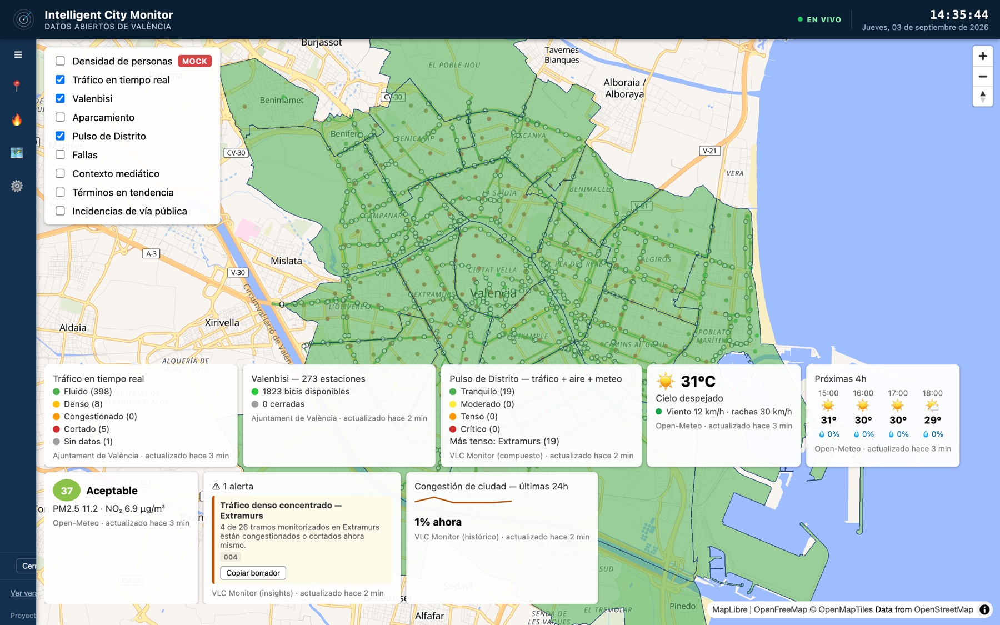
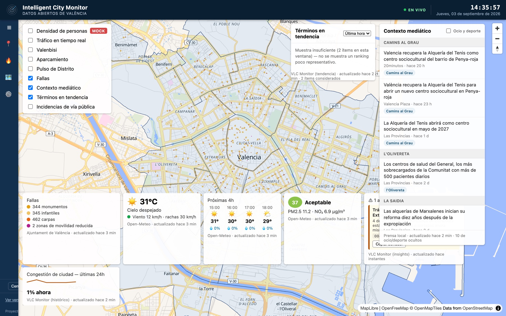
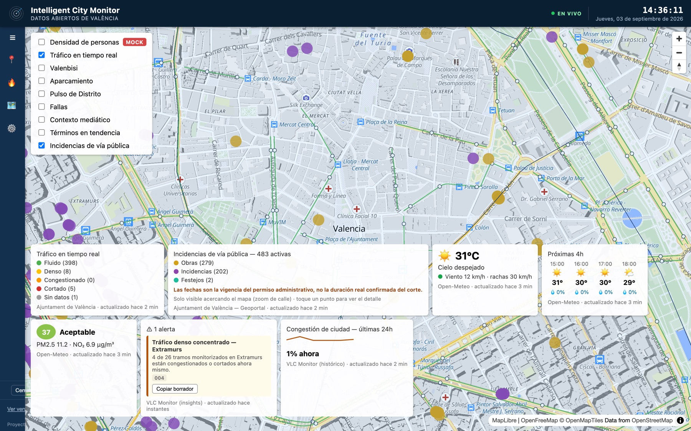
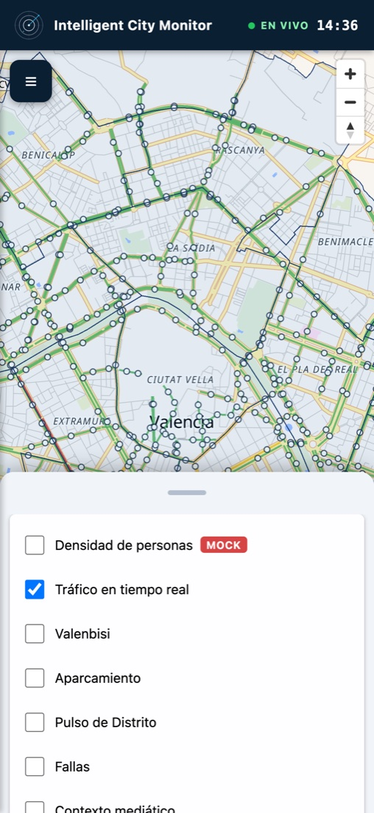

<div align="center">

# Intelligent City Monitor

**Un mapa vivo de la ciudad de València: movilidad, meteorología, calidad del aire,
eventos e incidencias, agregados en un solo panel a partir de datos abiertos y
gratuitos.**

[**▶ Demo en vivo**](https://vlc-monitor.vercel.app) &nbsp;·&nbsp;
[Fuentes y licencias](docs/FUENTES_Y_LICENCIAS.md) &nbsp;·&nbsp;
[Roadmap](ROADMAP.md) &nbsp;·&nbsp;
[Índice de specs](specs/INDEX.md)

[](LICENSE)
[](docs/FUENTES_Y_LICENCIAS.md)


<em>English summary <a href="#english">below ↓</a></em>



</div>

---

## Qué es

Un panel único que responde a *"¿cómo está la ciudad ahora mismo?"* combinando en un
mapa interactivo señales públicas de València: tráfico, bici compartida, aparcamiento,
tiempo, aire, eventos (Fallas), obras y cortes de calle, y contexto de prensa local.

Está inspirado arquitectónicamente en [World Monitor](https://github.com/koala73/worldmonitor),
pero a escala de ciudad y sin su sobredimensionamiento: nada de globo 3D, nada de app
de escritorio, nada de multi-tenant. Es un **proyecto abierto (MIT)**: cualquiera puede
desplegarlo tal cual o partir de él. No tiene relación con ningún organismo oficial.

### Qué muestra

| Bloque | Capas |
|---|---|
| **Movilidad** | Tráfico en tiempo real (~412 tramos) · Valenbisi (273 estaciones) · Aparcamiento (ocupación %) |
| **Ambiente** | Meteorología actual + predicción a 4 h · Calidad del aire (European AQI) · Avisos AEMET *(opcional)* |
| **Síntesis** | **Índice de Pulso de Distrito** — lectura compuesta por zona (tráfico + aire + meteo adversa) · Motor de insights ("avisa, no actúa") |
| **Ciudad** | Fallas (monumentos, carpas, zonas de movilidad reducida) · Incidencias de vía pública (obras, cortes, festejos) |
| **Contexto** | Prensa local agregada y geolocalizada por distrito · Términos en tendencia |
| **Gestión municipal** | Grafo viario de la ciudad · Propuesta de cordón de seguridad por incidente · Simulador de cortes de calle con propagación dirigida |

Cada capa declara **su fuente y su frescura** (`actualizado hace N min`) y avisa
cuando sirve un dato cacheado no en vivo.

## Capturas

| Contexto mediático + Fallas | Detalle a nivel de calle |
|---|---|
| [](docs/capturas/contexto-mediatico.jpg) | [](docs/capturas/incidencias-calle.jpg) |

<div align="center">

<p><em>La misma app se adapta a móvil: cabecera compacta, sidebar como hoja y paneles en un <code>bottom sheet</code> arrastrable. Instalable como PWA.</em></p>
</div>

## Cómo está construido

```
fuente pública  ──►  seed / cron  ──►  caché propia  ──►  endpoint interno /api/*  ──►  capa de mapa
```

- **El navegador nunca llama a una fuente externa.** Siempre habla con endpoints
  internos que sirven datos cacheados, con *stale-on-error* (mejor un dato viejo
  marcado como viejo que un panel roto). Es el patrón que hace viable operar sobre
  *free tiers* sin que el volumen te expulse.
- **Registro único de capas.** Añadir una capa es una entrada en
  [`src/config/map-layer-definitions.ts`](src/config/map-layer-definitions.ts), no
  tocar N sitios.
- **Una sola función desplegada.** Todos los RPC se empaquetan (esbuild) en un router
  único (`api/router.js`) para caber en el límite de 12 funciones de Vercel Hobby.
  Las URLs públicas no cambian: `GET /api/<dominio>/v1/<recurso>`.
- **Grafo viario propio** (OpenStreetMap vía Overpass) con índice espacial `rbush`,
  sentido de circulación auditado, y un motor puro de **propagación dirigida de
  cortes** (alcanzabilidad sobre el grafo dirigido) compartido por el cordón de
  incidente y el simulador.

### Decisiones técnicas

| Tema | Elección | Por qué |
|---|---|---|
| Lenguaje | TypeScript (estricto) | Contratos de datos tipados en cada spec |
| Bundler | Vite | Cero configuración con Vercel |
| Mapa | MapLibre GL + deck.gl (**2D**) | A escala calle/distrito el globo 3D no aporta nada |
| Tiles | OpenFreeMap (sin clave) | Gratis, cero fricción |
| Caché | Patrón *seed → caché → bootstrap* | Operar sobre *free tiers* sin caerte de ellos |
| Hosting | Vercel Hobby + GitHub Actions (cron) | *Free tier* suficiente a esta escala |

Detalle y alternativas descartadas en [`CLAUDE.md`](CLAUDE.md) §5 y en las
[decisiones de arquitectura](docs/decisiones/).

### Proceso: Spec-Driven Development

Ninguna capa, endpoint o índice se escribe sin que **exista antes su spec** en
[`specs/`](specs/), con el contrato de datos y el de capa congelados, y un
*Definition of Done* que se verifica contra la fuente real antes de marcar la spec
como `Implemented`. El estado de cada pieza está en [`specs/INDEX.md`](specs/INDEX.md).

## Fuentes de datos y licencias

Todo lo que consume el proyecto es **gratuito y de acceso público**, sin contratos ni
claves de pago. El inventario completo — fuente, licencia y atribución de cada capa —
está en [**`docs/FUENTES_Y_LICENCIAS.md`**](docs/FUENTES_Y_LICENCIAS.md). En resumen:

- **Ajuntament de València · Geoportal ArcGIS** (CC BY 4.0) — distritos, tráfico,
  Valenbisi, aparcamiento, Fallas, incidencias de vía pública.
- **Open-Meteo** (CC BY 4.0, sin clave) — meteorología, predicción y calidad del aire.
- **AEMET OpenData** — avisos oficiales; clave gratuita y **opcional**.
- **OpenStreetMap / Overpass** (ODbL) — grafo viario.
- **OpenFreeMap + OpenMapTiles** — tiles del mapa base.
- **RSS de medios locales + Google News RSS + GDELT** — contexto mediático.

Ninguna capa usa datos de localización individual. La única capa con datos simulados
(`003`, densidad de personas) lleva un badge **`MOCK`** permanente.

## Desarrollo local

```bash
npm install
npm run dev          # Vite en http://localhost:3000
```

No hace falta configurar nada: todas las fuentes son públicas y el frontend solo
habla con los endpoints internos.

```bash
npm run typecheck
npm run test          # vitest
npm run build         # dist/ + bundle de la función de API
```

## Despliegue

Cualquier host de estáticos + funciones sirve. En **Vercel** (Vite se detecta solo):
importa el repo y despliega. Sin variables de entorno la app queda **abierta** (modo
demo, como la [demo en vivo](https://vlc-monitor.vercel.app)).

<details>
<summary><strong>Despliegue privado con acceso restringido (opcional)</strong></summary>

Para servir la app tras un login de usuario + PIN, define dos variables de entorno
(`middleware.ts` activa el *gate* solo si existen):

```bash
openssl rand -hex 32              # -> AUTH_SECRET
npm run auth:hash -- alicia        # pide el PIN por consola, sin eco -> {u,h,s}
```

Junta todas las entradas en un array JSON en `APP_USERS` y añade ambas variables al
despliegue. Alta/baja de un acceso = editar `APP_USERS` y volver a desplegar. En
local, un `.env` (git-ignored) con esas dos variables activa el *gate* para probarlo.

</details>

<details>
<summary><strong>PWA y marca</strong></summary>

La app es una PWA instalable (Android/Chrome → "Añadir a pantalla de inicio";
iOS/Safari → Compartir → "Añadir a pantalla de inicio"), con *shell* offline y aviso
de nueva versión (nunca recarga sola).

El logo es un **placeholder neutro generado** (`npm run marca`, Node puro). Sustituye
`public/assets/logo.png` por el tuyo y vuelve a lanzar `npm run marca`. El nombre, el
*tagline* y el pie están en [`src/config/marca.ts`](src/config/marca.ts) — cambiarlos
ahí es todo lo necesario para re-marcar un despliegue.

</details>

## Ética y alcance

Este proyecto tiene un **límite ético/legal duro** ([`CLAUDE.md`](CLAUDE.md) §4):
ningún dato de localización individual, ninguna fuente fuera de un cauce legal
explícito, *"avisa no actúa"* en toda capa de alertas, y todo dato simulado marcado de
forma visible. Cualquier despliegue que quiera orientación operativa específica la
añade por su cuenta, fuera de este repo, con su propia autorización y cumplimiento.

## Licencia

Código bajo licencia [MIT](LICENSE). Los datos de terceros conservan sus respectivas
licencias — ver [`docs/FUENTES_Y_LICENCIAS.md`](docs/FUENTES_Y_LICENCIAS.md).

---

<a name="english"></a>

## English

**Intelligent City Monitor** is a live map of the city of València that aggregates
public, free data sources into a single interactive panel: real-time traffic, bike
share, parking, weather, air quality, events, roadworks and street closures, and local
press context.

It's architecturally inspired by [World Monitor](https://github.com/koala73/worldmonitor),
but right-sized to a single city — no 3D globe, no desktop app, no multi-tenancy. It's
an **open project (MIT)**: deploy it as-is or fork it. Not affiliated with any
government body.

**[▶ Live demo](https://vlc-monitor.vercel.app)**

### Highlights

- **One cross-source map**, not a set of separate dashboards. Every layer declares its
  **source and freshness**, and flags when it's serving stale (cached, not live) data.
- **Composite "District Pulse" index** — a synthetic per-zone reading (traffic + air +
  adverse weather), plus an insights engine that only ever *alerts a human*, never acts.
- **Municipal-management tools** — a city road graph (OpenStreetMap via Overpass) with
  a pure *directed closure-propagation* engine shared by an incident-cordon proposer
  and a "what if we close these streets?" simulator.
- **Runs at ~0 €.** The browser never calls an external source directly — it talks to
  internal endpoints serving cached data with *stale-on-error*, the pattern that makes
  free tiers viable. One bundled function on Vercel Hobby; cron seeds on GitHub Actions.
- **Spec-driven** — no layer or endpoint ships without a frozen data contract and a
  Definition of Done verified against the real source first. See [`specs/INDEX.md`](specs/INDEX.md).

### Stack

TypeScript (strict) · Vite · MapLibre GL + deck.gl (2D) · OpenFreeMap tiles · Vercel
edge functions for caching · GitHub Actions for cron seeds.

### Data & licensing

Every source is free and publicly accessible, no paid keys or contracts. Full
inventory — source, license and attribution per layer — in
[`docs/FUENTES_Y_LICENCIAS.md`](docs/FUENTES_Y_LICENCIAS.md). Key sources: Ajuntament de
València Open Data / Geoportal (CC BY 4.0), Open-Meteo (CC BY 4.0), AEMET OpenData
(free, optional key), OpenStreetMap / Overpass (ODbL), OpenFreeMap + OpenMapTiles for
base tiles, local news RSS + Google News RSS + GDELT for press context. No
individual-location data; the one simulated layer carries a permanent `MOCK` badge.

### Run it

```bash
npm install
npm run dev        # http://localhost:3000 — no configuration needed
npm run test
npm run build
```

Code is [MIT](LICENSE) licensed; third-party data keeps its own licenses.
