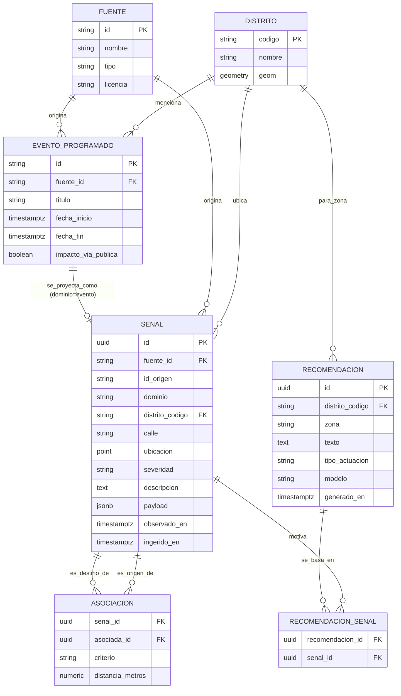

# Mirall — Modelo de datos de dominio

**Fecha:** 2026-09-17
**Estado:** Propuesta — architecture gate pedido explícitamente por el usuario antes de
implementar la escritura histórica de `047` (`ADR-006`, Postgres serverless). Este
documento se revisa y se acuerda **antes** de escribir ninguna migración SQL real contra
la base de datos.

**Misión de Mirall** (declarada por el usuario, 2026-09-17): *"Mirall transforma
información pública dispersa en una representación coherente de la ciudad que permite
comprender qué está ocurriendo y tomar decisiones."* Todo lo que sigue se mide contra esa
frase: si una entidad o relación no ayuda a "comprender qué está ocurriendo" o a "tomar
decisiones", no pertenece a este modelo sin más justificación.

**Método seguido**: el modelo de las secciones 1-7 se construyó **desde el dominio**, sin
mirar el código ni las tablas actuales — a propósito, para no arrastrar inconsistencias ya
detectadas (ver `[[spec-046-draft-047-implementado]]`: severidad mal calibrada, ids
duplicados, arrays en vez de relaciones). La comparación con lo que existe hoy en código
llega después, en la §8, precisamente para poder señalar esas discrepancias en vez de
blanquearlas.

---

## 1. Entidades fundamentales

### 1.1 `Distrito` (con `Barrio` dentro)

La unidad espacial de referencia de toda la ciudad. Cambia poquísimo (solo si el
Ayuntamiento reorganiza distritos/barrios).

- **Qué es**: una zona administrativa con nombre, código oficial y geometría.
- **Por qué existe**: es el nivel al que Mirall agrega casi todo — clima, tráfico,
  recomendaciones — porque es la unidad que un humano reconoce ("Extramurs", "Poblats
  Marítims"), no un punto lat/lon suelto.
- **Naturaleza**: catálogo/dimensión — de referencia, no un hecho observado.

### 1.2 `Fuente`

De dónde viene un dato, en el sentido de **procedencia legal y técnica real** — no "qué
spec lo implementó" (eso es otra cosa, ver más abajo).

- **Qué es**: un proveedor externo de datos abiertos (DGT, AVAMET, Ayuntamiento de
  València/Geoportal, Open-Meteo, SAIH Júcar, AEMET...).
- **Atributos que importan**: nombre, tipo (API oficial / scraping / modelo meteorológico
  / comunitario), licencia/condiciones de reutilización, si requiere API key, cuándo se
  verificó por última vez a mano.
- **Por qué es una entidad propia y no un string suelto**: porque la licencia y la
  fiabilidad son propiedades **de la fuente**, no de cada dato individual — hoy el código
  repite esa información en comentarios de cada servicio (`src/services/*.ts`), sin un
  sitio único que responda "¿qué fuentes tenemos y bajo qué licencia?".

### 1.3 `Señal`

**La entidad central del dominio.** Un hecho observado sobre la ciudad, en un momento y un
lugar, procedente de una fuente. Esto es lo que hoy están reinventando, cada una a su
manera, `TramoTrafico`, `IncidenciaViaPublica`, `EstacionAvamet`, `PluviometroSaih`,
`CalidadAire`, `LluviaVientoDistrito`... (ver §8).

- **Qué es**: "en el distrito/calle X, a la hora Y, la fuente Z observó/midió W".
- **Por qué es UNA entidad y no una tabla por dominio**: porque la pregunta que Mirall
  necesita responder casi siempre cruza dominios ("qué pasó en esta calle" mezcla tráfico +
  incidencias + clima a la vez) — modelarlo como una tabla por fuente obliga a un `UNION`/
  `JOIN` distinto cada vez que se añade una fuente nueva. Una tabla única con un campo
  `dominio` y un `payload` flexible para lo específico de cada tipo escala mejor con el
  patrón real de crecimiento de este proyecto (una fuente nueva cada pocas specs).
- **Atributos que importan**: dominio (tráfico/incidencia/clima/calidad-aire/evento/
  cámara/aparcamiento/movilidad...), severidad (informativo/aviso/urgente — ya existe como
  concepto en `047`), descripción factual, ubicación (ver §4), momento observado y momento
  de ingesta (ver §5), fuente, identificador nativo de la fuente (para no duplicar).
- **Qué NO es**: no es una recomendación ni una decisión — solo el hecho. La IA no escribe
  aquí, solo lee.

### 1.4 `Asociación` (Señal↔Señal)

**Cómo se representa una correlación entre dos señales** — la pieza que la IA va a
consumir para razonar, y que un humano va a usar para investigar a posteriori.

- **Qué es**: "la señal A está relacionada con la señal B porque comparten distrito /
  están a menos de N metros / ocurrieron en la misma ventana horaria".
- **Por qué es una relación propia y no un array dentro de `Señal`**: un array de ids
  (`relacionadas: string[]`, que es justo lo que hace hoy `correlacion-senales.ts` en
  memoria) no se puede consultar en SQL de forma eficiente, no registra **por qué** se
  relacionaron (el criterio), y duplica la información en las dos direcciones sin
  garantía de consistencia. Una tabla de relación (arista) sí.

### 1.5 `Recomendación`

Una salida generada por IA a partir de un conjunto de señales, para una zona.

- **Qué es**: "para la zona X, dadas las señales [A, B, C], se sugiere condicionalmente Y".
- **Atributos que importan**: zona/distrito, texto (siempre condicional, `CLAUDE.md` §4),
  tipo de actuación sugerida, modelo que la generó, cuándo, advertencia fija.
- **Relación**: con las señales que la motivaron — misma lógica que `Asociación`, una
  tabla de relación (`Recomendación`↔`Señal`), no un array.
- **Límite duro, no negociable** (`CLAUDE.md` §4, reforzado en `047`): esta entidad nunca
  ejecuta nada ni identifica a una persona/vehículo. Es texto para que alguien lo revise.

### 1.6 `EventoProgramado`

Algo que **va a pasar** (o va a pasar en breve), no algo ya observado — la agenda de
eventos, partidos, conciertos con impacto vial (spec `027`).

- **Por qué es una entidad distinta de `Señal`**: su naturaleza temporal es opuesta —
  describe el futuro, no el pasado/presente, y su ciclo de vida es distinto (se
  actualiza por scraping periódico, no se re-observa cada pocos minutos). Cuando su
  ventana temporal llega, se **proyecta** hacia `Señal` (dominio `evento`) para que
  participe en la correlación en caliente — eso es exactamente lo que ya hace
  `correlacionarEventos()` en `047`, sin que haya que cambiar nada de esa lógica.
- **Relación**: con los distritos que menciona (join, no array — mismo principio).

### 1.7 Entidades explícitamente FUERA de este modelo

- **Usuario/sesión de acceso** (spec `018`) — es infraestructura de la aplicación, no
  conocimiento sobre la ciudad. No entra en "qué sabe Mirall sobre Valencia".
- **Protocolo de actuación** (spec `042`) — es contenido editorial fijo, redactado por el
  producto, no un dato observado de una fuente externa. Sigue viviendo en
  `src/config/protocolos-actuacion.ts`, no se migra.
- **Cordón de incidente / propuesta de corte / grafo viario** (specs `020`-`022`, `031`)
  — son simulaciones de sesión de cliente sobre un grafo, no hechos observados de la
  ciudad ni algo que necesite histórico persistente. Quedan fuera de este modelo tal cual
  están.
- **Ningún dato de localización individual** (`CLAUDE.md` §4) — ninguna entidad de este
  modelo identifica a una persona ni a un vehículo concreto. Todo es infraestructura
  pública o agregado por zona.

---

## 2. Relaciones entre entidades



---

## 3. Identificadores — regla general

| Entidad | Identificador | Por qué |
|---|---|---|
| `Distrito` | código oficial municipal (natural, ya existe) | Estable, público, no lo inventamos nosotros. |
| `Fuente` | slug estable (`dgt`, `avamet`, `open-meteo`, `ayto-valencia-geoportal`...) | Legible, no cambia, sirve de FK humano-legible. |
| `Señal` | `id` surrogate (UUID) **+** `UNIQUE(fuente_id, id_origen)` | El id nativo de cada fuente (`id_incidencia`, `objectid` del tramo, `esta` de AVAMET...) se guarda tal cual en `id_origen` — el `UNIQUE` compuesto es lo que permite un `INSERT ... ON CONFLICT DO NOTHING` idempotente. **Esto resuelve directamente el bug de incidencias duplicadas encontrado en `047`** (la fuente repetía el mismo `id_incidencia` en varias features — con esta regla, la segunda inserción simplemente no duplica). |
| `Asociación` | clave compuesta `(senal_id, asociada_id, criterio)` | Es una arista, no necesita id propio; la clave compuesta evita duplicar la misma arista dos veces. |
| `Recomendación` | `id` surrogate (UUID) | No tiene identidad natural — es generada. |
| `EventoProgramado` | slug de la URL de ficha (natural, ya existe y es estable) | Igual que `Distrito`: ya lo da la fuente, no hay que inventar nada. |

Regla general: **si la fuente ya da un identificador estable, se usa tal cual como clave
natural o como parte de una `UNIQUE`; solo se genera un surrogate cuando la entidad no
tiene identidad natural** (una `Señal` puede llegar sin id útil, o una `Recomendación` no
tiene ninguno posible).

---

## 4. Dimensión espacial

- `Distrito.geom`: polígono/multipolígono — ya existe como GeoJSON (`data/distritos-valencia.json`).
- `Señal`: cuando aplica, un punto (`lat`/`lon`) **más** `distrito_codigo` ya resuelto (no
  recalcular point-in-polygon en cada lectura) **más**, opcionalmente, `calle` en texto
  libre. Un tráfico (que es una línea, no un punto) guarda el punto medio como resumen —
  ya existe `puntoMedio()` en `src/services/trafico.ts` para esto — y, si hiciera falta la
  geometría completa alguna vez, puede vivir en `payload` sin tocar el esquema.

**Decisión (2026-09-17): columnas `double precision` sueltas para lat/lon, sin PostGIS por
ahora.** Se valoraron ambas opciones explícitamente:

| | PostGIS (`geography(Point,4326)`/`geography(MultiPolygon,4326)`) | Columnas sueltas (`lat`/`lon` + `distrito_codigo` ya resuelto) |
|---|---|---|
| Corrección geométrica | Resuelve casos borde reales (polígonos con agujeros, antimeridiano) que un point-in-polygon casero puede no cubrir | El point-in-polygon/haversine de `district-geometry.ts`/`proximidad.ts` ya está escrito, probado y en producción — funciona para el tamaño real de Valencia (19 distritos, geometrías simples) |
| Dónde vive el cálculo espacial | En SQL (`ST_Contains`/`ST_DWithin`) — el motor de base de datos hace el trabajo | En la app, antes de insertar (igual que hoy) — Postgres solo guarda el resultado ya resuelto |
| Coste operativo | Activar la extensión `postgis`, aprender su sintaxis (WKT/WKB, `ST_*`), índices `GiST` | Ninguno nuevo — mismo patrón que ya usa el resto del proyecto |
| Caso de uso real que lo necesitaría | Consultas de proximidad en SQL sobre volúmenes grandes, capas geométricas nuevas (tramos de calle completos, buffers) | Las 5 consultas de §11 no lo necesitan — todas filtran por `distrito_codigo`/`calle`/tiempo, ya resueltos antes de insertar |

**Por qué la opción simple, para este proyecto en concreto**: Mirall mueve cientos de
señales al día para una sola ciudad, no millones — el cuello de botella nunca ha sido el
cálculo espacial (ya resuelto y rápido en JS), y el proyecto ya prioriza "lo más simple que
funcione" sobre correitud teórica sin caso de uso real que la pida (mismo criterio que
`CLAUDE.md` §5 aplica al resto de decisiones técnicas). Añadir PostGIS ahora sería resolver
un problema que no tenemos, a cambio de una pieza operativa más que mantener en un
proyecto de una sola persona.

**No es una puerta cerrada**: si en el futuro aparece un caso real que lo justifique (capas
geométricas nuevas tipo grafo viario completo en la base de datos, consultas de proximidad
sobre volúmenes grandes), añadir PostGIS más adelante es aditivo — se activa la extensión y
se añade una columna `geography` generada a partir de `lat`/`lon` ya existentes, sin romper
nada de lo que consume `lat`/`lon`/`distrito_codigo` hoy. Sería su propia ADR cuando llegue
ese momento, no algo a decidir ahora sin necesidad.

## 5. Dimensión temporal

Distinción bitemporal que **ya existe de facto** en el código (`observedAt`/`fetchedAt` en
casi todos los servicios) — este modelo solo la formaliza como columnas reales:

- `observado_en`: cuándo era cierto el hecho en el mundo real.
- `ingerido_en`: cuándo Mirall lo capturó (puede ser bastante después, p. ej. si la caché
  sirvió un valor `stale`).

`EventoProgramado` usa en su lugar un rango de validez futuro (`fecha_inicio`/`fecha_fin`).
`Recomendación`/`Asociación` llevan su propio `generado_en`/`calculado_en`.

## 6. Procedencia/fuente

Cada `Señal` lleva **dos cosas distintas que el código actual mezcla en un solo campo**:

1. `fuente_id` → de dónde vino el dato **en el mundo real** (para licencia/atribución de
   cara al usuario — lo que hoy casi no se guarda de forma estructurada).
2. Opcionalmente, qué spec de este repo la produce (`fuenteSpec`, lo que ya existe hoy) —
   es trazabilidad **interna de ingeniería**, útil para depurar, pero es un concepto
   distinto de la licencia/atribución real. Se puede seguir guardando en `payload` sin
   necesidad de una columna propia.

## 7. Representación de asociaciones para la IA

Ya cubierto en §1.4/§1.5: **tablas de relación (aristas), nunca arrays**. Esto es lo único
de este documento con una motivación puramente orientada a la IA: para que un modelo (o un
humano) pueda preguntar "¿qué señales llevaron a esta recomendación?" o "¿qué está
relacionado con esta señal, y por qué?" con una query SQL normal, en vez de tener que
parsear un array de ids embebido en una fila. `047` ya calcula esto en memoria
(`SenalCorrelacionada.relacionadas`) — pasar a Postgres es literalmente escribir esas
mismas relaciones como filas en vez de como array, no rediseñar la lógica de correlación.

---

## 8. Comparación con el modelo actual en código

Inventario real (`src/services/*.ts`, 2026-09-17): **más de 30 interfaces `export
interface`** representan, cada una a su manera, un hecho observado sobre la ciudad
(`TramoTrafico`, `IncidenciaViaPublica`, `EstacionAvamet`, `PluviometroSaih`, `CalidadAire`,
`EstadoMeteo`, `LluviaVientoDistrito`, `CamaraExternaDgt`, `EventoAgenda`,
`ItemMediatico`...). Esto **no es un error a corregir de golpe** — cada una nace de
normalizar el formato crudo de su fuente, y esa capa de normalización (`src/services/
<fuente>.ts`) sigue teniendo sentido tal cual: cada fuente trae su propio formato, alguien
tiene que traducirlo.

**Lo que sí cambia es el destino final de esa normalización**, y aquí es donde este
documento evita "institucionalizar el error": en vez de sumar una tabla nueva por cada
fuente nueva (lo que ha venido pasando, spec a spec), el destino histórico común es la
tabla única `senal` de §1.3.

Buena noticia encontrada al revisar: **esto ya casi existe**. `SenalCorrelacionada`
(`src/services/correlacion-senales.ts`, escrito en `047` hace unas horas) es, de hecho, ya
una implementación *en memoria* del concepto `Señal` de este documento — con
`tipo`/`distritoCodigo`/`calle`/`lat`/`lon`/`severidad`/`descripcion`/`observedAt`/
`fetchedAt`/`fuenteSpec`. Lo que falta para que sea el modelo real:

| En código hoy (`047`) | En este modelo | Cambio necesario |
|---|---|---|
| `id: string` tipo `` `trafico:${id}` `` (compuesto, parseado por convención) | `id` (UUID) + `fuente_id` + `id_origen` (columnas separadas) | Separar en dos columnas reales — así el `UNIQUE(fuente_id, id_origen)` puede hacer su trabajo (§3), en vez de fiarnos de una convención de string. |
| `fuenteSpec: string[]` (specs de este repo) | `fuente_id` (procedencia real) + `payload.fuenteSpec` (trazabilidad interna, opcional) | Añadir la columna que falta; lo que ya existe se conserva en `payload`, no se pierde. |
| `relacionadas: string[]` | tabla `asociacion` | Dejar de calcular esto solo en memoria por request — persistirlo cuando se escriba la señal. |
| `RecomendacionActuacion.situacionAsociada: string[]` | tabla `recomendacion_senal` | Mismo principio que arriba. |
| `EventoAgenda`/`SnapshotAgenda` (snapshot único, sobreescrito cada scraping, `data/agenda-eventos.json`) | `evento_programado` (tabla con histórico real, upsert por slug) | Ganancia real: hoy se pierde el histórico de ediciones de la agenda; con Postgres no. |
| `data/trafico-historico.json` + `data/trafico-historico-diario.json` (rollup calculado una vez, baked en build — spec `017`) | Rollups calculados con `SELECT` sobre `senal` en vivo | **No migrar de golpe** — es el ejemplo más claro de mecanismo que el nuevo modelo puede sustituir con el tiempo, pero es una migración de la spec `017`/`024`, fuera de alcance de esto. Se anota como candidato futuro, no se toca ahora. |
| `data/distritos-valencia.json` (GeoJSON estático) | tabla `distrito` (opcional) | Si se adopta PostGIS (§4), tiene sentido cargarlo una vez en Postgres para poder hacer `ST_Contains` en SQL. Si no, se queda tal cual — no es una migración obligatoria. |
| `src/config/protocolos-actuacion.ts` | *(no aplica)* | No se migra — es contenido editorial, no dato observado (§1.7). |

## 9. Qué se migra y qué se queda igual (resumen)

**Se migra a Postgres** (cuando exista y `047` retome la escritura histórica):
- Cada `Señal` nueva que ya calcula `correlacion-senales.ts` (tráfico/incidencia/clima/
  evento/cámara) — como filas `senal`, además de servirse en caliente igual que ahora.
- Las relaciones (`relacionadas` de `047`) — como filas `asociacion`.
- Las recomendaciones generadas — como filas `recomendacion` + `recomendacion_senal`.
- La agenda de eventos (`EventoAgenda`) — como filas `evento_programado`, ganando
  histórico real por primera vez.

**Se queda igual, no se migra**:
- `data/distritos-valencia.json` (salvo que se adopte PostGIS explícitamente).
- `src/config/protocolos-actuacion.ts`, config de marca, feature flags, credenciales.
- Todo lo de sesión de cliente sin componente histórico real: cordón de incidente,
  propuesta de corte, grafo viario (specs `020`-`022`, `031`).
- `trafico-historico.json`/`-diario.json` — se queda como está por ahora; se anota como
  candidato a sustituir más adelante, en su propia spec, no en esta migración.

## 10. Esquema físico propuesto (Postgres) — propuesta, sin ejecutar todavía

```sql
create table fuente (
  id text primary key,
  nombre text not null,
  tipo text not null,           -- 'oficial-api' | 'scraping' | 'modelo' | 'comunitario'
  licencia text,
  url_base text,
  requiere_api_key boolean not null default false,
  verificado_en date
);

create table distrito (
  codigo text primary key,
  nombre text not null
  -- geom geography(MultiPolygon, 4326) -- si se adopta PostGIS (§4)
);

create table senal (
  id uuid primary key default gen_random_uuid(),
  fuente_id text not null references fuente(id),
  id_origen text not null,
  dominio text not null,          -- 'trafico' | 'incidencia' | 'clima' | 'evento' | 'camara' | ...
  distrito_codigo text references distrito(codigo),
  calle text,
  lat double precision,
  lon double precision,
  severidad text not null,        -- 'informativo' | 'aviso' | 'urgente'
  descripcion text not null,
  payload jsonb not null default '{}',
  observado_en timestamptz not null,
  ingerido_en timestamptz not null default now(),
  unique (fuente_id, id_origen)
);
create index on senal (distrito_codigo, observado_en);
create index on senal (calle, observado_en);
create index on senal (dominio, severidad, observado_en);

create table asociacion (
  senal_id uuid not null references senal(id) on delete cascade,
  asociada_id uuid not null references senal(id) on delete cascade,
  criterio text not null,          -- 'mismo-distrito' | 'proximidad' | 'ventana-temporal'
  distancia_metros numeric,
  primary key (senal_id, asociada_id, criterio)
);

create table recomendacion (
  id uuid primary key default gen_random_uuid(),
  distrito_codigo text references distrito(codigo),
  zona text not null,
  texto text not null,
  tipo_actuacion text not null,
  modelo text not null,
  generado_en timestamptz not null default now()
);

create table recomendacion_senal (
  recomendacion_id uuid not null references recomendacion(id) on delete cascade,
  senal_id uuid not null references senal(id) on delete cascade,
  primary key (recomendacion_id, senal_id)
);

create table evento_programado (
  id text primary key,            -- slug de la ficha, ya estable
  fuente_id text not null references fuente(id),
  titulo text not null,
  categoria text,
  fecha_inicio timestamptz not null,
  fecha_fin timestamptz not null,
  impacto_via_publica boolean not null default false,
  url text
);

create table evento_distrito (
  evento_id text not null references evento_programado(id) on delete cascade,
  distrito_codigo text not null references distrito(codigo),
  coincidencia text not null,      -- 'distrito' | 'barrio'
  baja_confianza boolean not null default false,
  primary key (evento_id, distrito_codigo)
);
```

## 11. Casos de uso — consultas que demuestran que el modelo aguanta

**1. Tiempo real cruzado por distrito** ("¿qué está pasando ahora en Extramurs?" — el caso
ya implementado en `047`):
```sql
select s.*, f.nombre as fuente_nombre
from senal s join fuente f on f.id = s.fuente_id
where s.distrito_codigo = '03'
  and s.severidad in ('aviso','urgente')
  and s.observado_en > now() - interval '2 hours'
order by s.severidad, s.observado_en desc;
```

**2. Investigación a posteriori por calle y ventana horaria** (el caso de uso "policial"
explícito del usuario — reconstruir qué pasó en un punto concreto):
```sql
select *
from senal
where calle ilike '%colón%'
  and observado_en between '2026-09-17 18:00' and '2026-09-17 20:00'
order by observado_en;
```

**3. Tendencia por distrito a lo largo del tiempo** (sustituye el rollup baked-in de
`trafico-historico.json` por una query real):
```sql
select distrito_codigo, date_trunc('week', observado_en) as semana,
       count(*) filter (where severidad = 'urgente') as senales_urgentes
from senal
where dominio = 'trafico' and observado_en > now() - interval '1 month'
group by 1, 2
order by 1, 2;
```

**4. Trazabilidad de una recomendación pasada** (auditar si una recomendación de IA tenía
sentido — el requisito de "investigar, ayudar, colaborar" del usuario):
```sql
select r.generado_en, r.zona, r.texto, s.dominio, s.descripcion, s.observado_en
from recomendacion r
join recomendacion_senal rs on rs.recomendacion_id = r.id
join senal s on s.id = rs.senal_id
where r.distrito_codigo = '07'
order by r.generado_en desc;
```

**5. Correlación entre eventos programados y tráfico real** (¿los eventos que anticipamos
de verdad generaron el impacto esperado?):
```sql
select e.titulo, e.fecha_inicio,
       count(s.id) filter (where s.severidad in ('aviso','urgente')) as senales_trafico_relevantes
from evento_programado e
join evento_distrito ed on ed.evento_id = e.id
left join senal s
  on s.distrito_codigo = ed.distrito_codigo
  and s.dominio = 'trafico'
  and s.observado_en between e.fecha_inicio and e.fecha_fin
where e.impacto_via_publica
group by e.id, e.titulo, e.fecha_inicio
order by e.fecha_inicio desc;
```

---

## 12. Qué NO cubre este documento

- No congela el esquema para "los próximos cinco años" — congela lo mínimo necesario para
  que `047` pueda empezar a escribir histórico sin institucionalizar los bugs ya
  encontrados (ids duplicados, arrays sin trazabilidad, severidad mal calibrada).
- PostGIS vs columnas sueltas ya está decidido (§4: columnas sueltas, sin PostGIS por
  ahora) — no es una decisión abierta, es aditiva si algún día hace falta reabrirla.
- No migra `trafico-historico`/distritos/protocolos de golpe — cada uno queda anotado con
  su propio criterio (§9), para abordarse en su propia spec si procede.
- No cambia ni relaja `CLAUDE.md` §4 en ningún punto — ninguna entidad de este modelo
  identifica a una persona o vehículo concreto, y `Recomendación` sigue siendo
  puramente advisoria.

## 13. Siguiente paso

Este documento es el gate — antes de escribir la migración SQL real contra Neon:

1. El usuario crea el proyecto Neon (ver mensaje de chat correspondiente — requiere una
   cuenta, paso que no puede hacer una sesión de Claude Code) y comparte la cadena de
   conexión (solo por env var, nunca en un fichero versionado — mismo patrón que
   `GOOGLE_GENERATIVE_AI_API_KEY`).
2. Se revisa/ajusta este documento con lo que el usuario quiera cambiar.
3. Solo entonces: migración SQL real (§10, ajustado), cliente Postgres en
   `src/server/_shared/`, y la escritura histórica de `047` (pendiente desde su v2).
